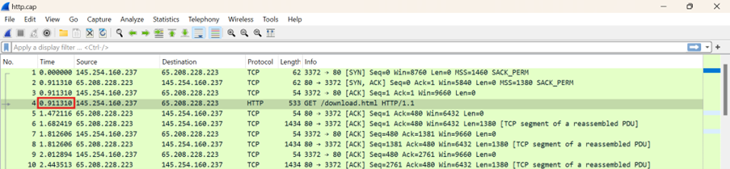

  <h1 style="text-align: center;font-weight: bold">Workshop Administrasi Jaringan </h1>
  <h4 style="text-align: center;">Dosen Pengampu : Dr. Ferry Astika Saputra, S.T., M.Sc.</h4>

 

  
  <h3 style="text-align: center;">Disusun Oleh :</h3>
  

    <strong>Hawa Kharisma Zahara (3123500010)</strong>
  

<h3 style="text-align: center;line-height: 1.5">Politeknik Elektronika Negeri Surabaya Departemen Teknik Informatika Dan Komputer Program Studi D3 Teknik Informatika 2025/2026</h3>
  

 

**1. Analisa file http.cap dengan wireshark :** 

**Versi HTTP yang digunakan**

Pada gambar diatas menunjukkan bahwa versi HTTP yang digunakan adalah HTTP/1.1
Hal ini dapat dilihat pada baris ke-4 dalam kolom Info, di mana terdapat permintaan GET /download.html HTTP/1.1 yang menunjukkan bahwa komunikasi menggunakan protokol HTTP versi 1.1.

**IP address dari client maupun server**

 
 

IP Address client : 145.254.160.237 IP Address Server : 65.208.228.223

**Waktu dari client mengirimkan HTTP request.**

Pada gambar diatas menunjukkan 0,911310 detik adalah waktu ketika client mengirimkan HTTP request.

**Waktu dari server mengirimkan server dan berapa durasinya**

3,955688 detik adalah waktu dari server merespon HTTP request.

Dari gambar diatas terlihat bahwa waktu untuk menyelesaikan 1 sesi adalah 4,846969. Maka durasi yang dibutuhkan adalah 
4,846969 – 3,955688 = 0,891281 detik. 

**2. Deskripsi gambar pada slide.**

  

 
Gambar diatas menunjukkan jenis-jenis pengiriman data dalam jaringan, mulai dari node to node, host to host, hingga proses to proses.

1.	Pada gambar diatas, pengiriman Node to node adalah proses data melewati beberapa perangkat jaringan (node), seperti router. Hal ini adalah tanggung jawab lapisan data link, yang memastikan data dikirim dari satu node ke node berikutnya hingga sampai ke tujuan.

2.	Selanjutnya pengiriman Host to host ini juga menunjukkan dua komputer yang terhubung melalui internet. Data dikirim dari satu komputer ke komputer lainnya melalui beberapa node, yang merupakan tugas lapisan jaringan.

3.	Pengiriman Proses to proses. Komunikasi sebenarnya terjadi antara dua proses, bukan hanya antar perangkat. Seperti yang ditunjukkan dalam gambar, ada dokumen yang mewakili proses yang berkomunikasi melalui jaringan. Ini adalah tanggung jawab lapisan transport, yang memastikan data dikirim ke proses yang tepat di komputer tujuan.

Komunikasi ini biasanya mengikuti pola klien/server, di mana satu proses meminta layanan, dan proses lainnya memberikan respons.

**3. Rangkuman tahapan komunikasi menggunakan TCP**

Komunikasi menggunakan TCP (Transmission Control Protocol) melibatkan beberapa tahapan penting untuk memastikan pengiriman data yang andal dan terurut antara dua proses. Berikut adalah rangkuman tahapan komunikasi menggunakan TCP:

1.	Pembentukan Koneksi (Three-Way Handshake):

    - SYN: Klien mengirimkan segmen SYN (synchronize) ke server untuk memulai koneksi.  
    - SYN-ACK: Server merespons dengan segmen SYN-ACK (synchronize-acknowledge) untuk mengonfirmasi penerimaan SYN.
    - ACK: Klien mengirimkan segmen ACK (acknowledge) ke server untuk menyelesaikan handshake dan membangun koneksi.

2.	Data Transmission:

    - Setelah koneksi terbentuk, data dapat dikirimkan antara klien dan server.
    - TCP memastikan data dikirim secara terurut dengan menggunakan mekanisme seperti acknowledgment, retransmission, dan flow control.

3.	Pengakhiran Koneksi (Four-Way Handshake):

    - FIN: Salah satu pihak (biasanya klien) mengirimkan segmen FIN (finish) untuk menunjukkan bahwa mereka ingin mengakhiri koneksi.
    - ACK: Pihak lain (server) mengirimkan segmen ACK untuk mengonfirmasi penerimaan FIN.
    - FIN: Server kemudian mengirimkan segmen FIN sendiri untuk menunjukkan bahwa mereka juga siap mengakhiri koneksi.
    -  ACK: Klien mengirimkan segmen ACK terakhir untuk mengonfirmasi penerimaan FIN dari server, dan koneksi ditutup.

### Referensi

- [Transmission Control Protocol/Internet Protocol](https://online.binus.ac.id/2021/09/24/tcp-ip-transmission-control-protocol-internet-protocol/)
- [Transmission Control Protocol](https://www.exabytes.co.id/blog/transmission-control-protocol/)

