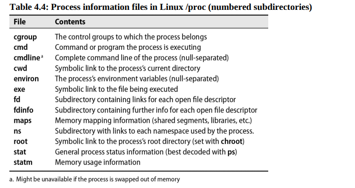

<div align="center">
  <h1 style="text-align: center;font-weight: bold">Laporan<br>Workshop Administrasi Jaringan<br></h1>
  <h4 style="text-align: center;">Dosen Pengampu : Dr. Ferry Astika Saputra, S.T., M.Sc.</h4>
</div>
<br />
<div align="center">
  
  <h3 style="text-align: center;">Disusun Oleh :</h3>
  <p style="text-align: center;">
    <strong>Hawa Kharisma Zahara (3123500010)</strong>
  </p>
<h3 style="text-align: center;line-height: 1.5">Politeknik Elektronika Negeri Surabaya<br>Departemen Teknik Informatika Dan Komputer<br>Program Studi D3 Teknik Informatika<br>2025/2026</h3>
  <hr>
</div>
<br>

---

## Chapter 4: Process Control

### Daftar Isi

- [Komponen-komponen Proses](#komponen-komponen-proses)
- [PID: nomor ID proses](#pid-nomor-id-proses)
- [PPID: nomor ID proses induk](#ppid-nomor-id-proses-induk)
- [UID dan EUID: ID pengguna dan ID pengguna yang efektif](#uid-dan-euid-id-pengguna-dan-id-pengguna-yang-efektif)
- [Daur hidup sebuah proses](#daur-hidup-sebuah-proses)
- [Sinyal](#sinyal)
- [Kill: mengirim sinyal](#kill-mengirim-sinyal)
- [PS: Proses Pemantauan](#ps-proses-pemantauan)
- [Pemantauan interaktif dengan top](#pemantauan-interaktif-dengan-top)
- [Nice dan renice: mengubah prioritas proses](#nice-dan-renice-mengubah-prioritas-proses)
- [Sistem berkas /proc](#sistem-berkas-proc)
- [Strace dan truss](#strace-dan-truss)
- [Proses yang berhenti](#proses-yang-berhenti)
- [Proses berkala](#Proses-berkala)
- [manajemen crontab](#manajemen-crontab)
- [Pengatur waktu systemd](#pengatur-waktu-systemd)
- [Penggunaan umum untuk tugas terjadwal](#penggunaan-umum-untuk-tugas-terjadwal)
- [Kesimpulan](#kesimpulan)

### Komponen-komponen Proses
Sebuah proses terdiri dari sebuah ruang alamat dan sekumpulan struktur data di dalam kernel. Ruang alamat adalah sekumpulan halaman memori yang telah ditandai oleh kernel untuk digunakan oleh proses, biasanya berukuran 4KiB atau 8KiB untuk menyimpan kode, data, dan tumpukan. Kernel menggunakan struktur data untuk melacak status proses, prioritas, parameter penjadwalan proses dan sebagainya.
Proses adalah wadah yang berisi sumber daya seperti memori, deskriptor file, dan atribut yang menggambarkan keadaan proses, dikelola oleh kernel untuk program yang berjalan.

Struktur data internal kernel mencatat berbagai informasi tentang setiap proses:

- Peta ruang alamat proses
- Status proses saat ini (sedang berjalan, tidur, dan seterusnya)
- Prioritas proses
- Informasi tentang sumber daya yang digunakan proses (CPU, memori, dan sebagainya)
- Informasi tentang file dan port jaringan yang telah dibuka oleh proses
- Topeng sinyal proses (sekumpulan sinyal yang saat ini diblokir)
- Pemilik proses (ID pengguna dari pengguna yang memulai proses)

Thread adalah unit eksekusi dalam proses yang berbagi ruang alamat dan sumber daya. Thread digunakan untuk mencapai paralelisme dalam sebuah proses. Thread lebih ringan dan lebih efisien dibandingkan proses.

Contoh:

Server web mendengarkan koneksi yang masuk dan kemudian membuat thread baru untuk menangani setiap permintaan yang masuk. Setiap thread menangani satu permintaan dalam satu waktu, tetapi server web secara keseluruhan dapat menangani banyak permintaan secara bersamaan karena memiliki banyak thread. Di sini, server web adalah sebuah proses, dan setiap thread adalah konteks eksekusi yang terpisah di dalam proses.


### PID: nomor ID proses

Setiap proses diidentifikasi dengan nomor ID proses yang unik, atau PID. PID adalah bilangan bulat yang diberikan kernel kepada setiap proses ketika proses dibuat. PID digunakan untuk merujuk ke proses dalam berbagai panggilan sistem, misalnya, untuk mengirim sinyal ke proses.

### PPID: nomor ID proses induk

Setiap proses juga dikaitkan dengan proses induk, yaitu proses yang membuatnya. Nomor ID proses induk, atau PPID, adalah PID dari induk proses. PPID digunakan untuk merujuk ke proses induk dalam berbagai panggilan sistem, misalnya, untuk mengirim sinyal ke proses induk.

### UID dan EUID: ID pengguna dan ID pengguna yang efektif

UID (User ID) adalah identitas pengguna yang menjalankan suatu proses, sedangkan EUID (Effective User ID) menentukan hak akses proses terhadap sumber daya. EUID berfungsi untuk mengatur izin akses ke file, port jaringan, dan sumber daya lainnya.

### Daur hidup sebuah proses
Untuk membuat proses baru, sebuah proses dapat menduplikasi dirinya menggunakan sistem call **fork**. Perintah ini menghasilkan salinan dari proses induk yang hampir sepenuhnya identik, tetapi dengan *PID* yang berbeda serta informasi akuntansi tersendiri. Di Linux, **clone** digunakan sebagai versi lebih luas dari fork, menangani thread dan fitur tambahan. Meskipun fork masih tersedia untuk kompatibilitas, secara internal sistem akan memanggil **clone**.
Saat sistem melakukan booting, kernel secara otomatis membuat dan menginisialisasi beberapa proses. Salah satu yang paling penting adalah **init** atau **systemd** ,yang selalu menjadi proses nomor 1. Proses ini menjalankan skrip startup sistem, meskipun metode eksekusinya dapat berbeda antara UNIX dan Linux. Semua proses di luar yang dibuat langsung oleh kernel berasal dari proses awal ini.

#### Sinyal
Sinyal adalah mekanisme untuk memberikan notifikasi kepada suatu proses tentang kejadian tertentu. Sinyal digunakan untuk memberi tahu proses ketika suatu peristiwa terjadi.
Terdapat sekitar tiga puluh jenis sinyal yang memiliki berbagai fungsi, antara lain:
Sinyal dapat dikirim antarproses sebagai sarana komunikasi.
Sinyal dapat dikirim oleh driver terminal untuk menghentikan, menginterupsi, atau menangguhkan proses saat tombol tertentu ditekan.
Sinyal dapat dikirim oleh administrator (dengan perintah kill) untuk berbagai tujuan.
Sinyal dapat dikirim oleh kernel ketika suatu proses melakukan pelanggaran, seperti pembagian dengan nol.
Sinyal dapat dikirim oleh kernel untuk memberi tahu proses tentang kondisi tertentu, seperti matinya proses anak atau tersedianya data pada saluran I/O.

 

Sinyal **KILL**, **INT**, **TERM**, **HUP**, dan **QUIT** tampak memiliki fungsi serupa, tetapi sebenarnya memiliki kegunaan yang berbeda.

- **KILL** adalah sinyal yang tidak bisa diblokir dan langsung menghentikan proses di tingkat kernel. Proses tidak dapat menangkap atau menangani sinyal ini.
- **INT** dikirim oleh driver terminal saat pengguna menekan kombinasi tombol tertentu. Sinyal ini meminta proses untuk menghentikan operasi yang sedang berjalan. Program sederhana biasanya keluar saat menerima sinyal ini, sedangkan program dengan antarmuka interaktif (seperti shell) sebaiknya menghentikan tugasnya, membersihkan status, lalu menunggu input pengguna kembali.
- **TERM** adalah permintaan untuk mengakhiri eksekusi secara keseluruhan. Proses yang menerima sinyal ini sebaiknya membersihkan statusnya sebelum keluar.
- **HUP** dikirim ke suatu proses ketika terminal yang mengontrolnya ditutup. Awalnya digunakan untuk menandakan terputusnya koneksi telepon, tetapi sekarang sering digunakan untuk meminta proses daemon berhenti dan memulai ulang guna menerapkan konfigurasi baru. Cara proses merespons sinyal ini tergantung pada jenis prosesnya.
- **QUIT** memiliki fungsi serupa dengan TERM, tetapi jika tidak ditangani, secara default akan menghasilkan core dump. Beberapa program menggunakan sinyal ini untuk tujuan lain sesuai kebutuhannya.

#### kill: mengirim sinyal
Perintah **kill** biasanya digunakan untuk menghentikan proses. Secara default, perintah ini mengirim sinyal **TERM**, tetapi bisa juga digunakan untuk mengirim sinyal lain. Pengguna biasa hanya bisa menghentikan proses miliknya sendiri, sedangkan root bisa menghentikan proses apa pun.
Format penggunaan:

    kill [-sinyal] pid

sinyal: nomor atau nama sinyal yang dikirim.
pid: ID proses yang ingin dihentikan.
Jika **kill** dijalankan tanpa menyertakan nomor sinyal, proses mungkin tidak langsung berhenti karena sinyal TERM bisa ditangkap atau diabaikan. Namun, jika menggunakan **kill -9 pid**, proses pasti akan dihentikan karena sinyal KILL tidak bisa ditangkap, diblokir, atau diabaikan.

**killall** : Menghentikan Proses Berdasarkan Nama
Perintah killall digunakan untuk menghentikan semua proses dengan nama tertentu, bukan berdasarkan PID. Namun, tidak semua sistem memiliki perintah ini.
Contoh:

    killall firefox

(perintah ini akan menghentikan semua proses dengan nama firefox)

**pkill** : Versi Lebih Fleksibel dari killall
Perintah **pkill** mirip dengan **killall**, tetapi memiliki lebih banyak opsi.

Contoh:

    pkill -u abdoufermat

(perintah ini akan menghentikan semua proses milik pengguna abdoufermat)

### PS: Proses Pemantauan
Perintah **ps** merupakan alat penting bagi administrator sistem untuk memantau proses yang berjalan. Meskipun tampilan dan argumen **ps** bisa berbeda di tiap sistem, informasi yang ditampilkan tetap serupa.
Dengan**ps**, pengguna dapat melihat PID (Process ID), UID (User ID), prioritas proses, dan terminal yang mengontrol proses. Selain itu, perintah ini juga menampilkan jumlah memori yang digunakan, waktu CPU yang telah dipakai, serta status proses (seperti berjalan, berhenti, atau dalam mode tidur).
Untuk melihat gambaran umum proses dalam sistem, gunakan perintah:

    ps aux

- a: Menampilkan semua proses dari berbagai pengguna.
- u: Menampilkan detail lengkap tentang setiap proses.
- x: Menampilkan proses yang tidak terkait dengan terminal tertentu.


   

Satu set argumen lain yang berguna adalah lax, yang memberikan lebih banyak informasi teknis tentang proses. lax sedikit lebih cepat daripada aux karena tidak perlu menyelesaikan nama pengguna dan grup

   

Untuk mencari proses tertentu, Anda bisa menggunakan grep untuk memfilter output ps.

    $ ps aux | grep -v grep | grep firefox

Kita dapat menentukan PID dari sebuah proses dengan menggunakan pgrep.

    $ pgrep firefox

atau pidof.

    $ pidof /usr/bin/firefox

### Pemantauan interaktif dengan top

Perintah **top** menampilkan informasi sistem secara real-time, termasuk ringkasan sistem dan daftar proses yang berjalan. Pengguna bisa mengatur tampilan informasi ini dan menyimpannya agar tetap berlaku setelah restart.
Perintah **htop** adalah versi interaktif dari **top**, memungkinkan pengguna menggulir tampilan secara vertikal dan horizontal untuk melihat semua proses beserta perintah lengkapnya. **htop** memiliki antarmuka yang lebih intuitif dan fitur tambahan untuk pengelolaan proses.

### Nice dan renice: mengubah prioritas proses
Nice adalah nilai yang menentukan prioritas proses dalam penggunaan CPU. Nilainya berkisar antara -20 hingga +19 di Linux, di mana nilai lebih rendah berarti prioritas lebih tinggi. Proses dengan nilai nice tinggi memiliki prioritas rendah, sedangkan nilai nice rendah mendapat prioritas tinggi.
Jika ada proses berat yang dijalankan di latar belakang, sebaiknya diberi nilai nice tinggi agar tidak mengganggu proses lain. Perintah nice digunakan untuk memulai proses dengan nilai nice tertentu, sementara renice digunakan untuk mengubah nilai nice proses yang sedang berjalan.
Sintaks dan Contoh:
Menjalankan proses dengan nice tertentu:

	nice -n nice_val [command]
Contoh:

	nice -n 10 sh infinite.sh &

Mengubah nilai nice proses yang sedang berjalan:

	renice -n nice_val -p pid
Contoh:

	renice -n 10 -p 1234
Hubungan antara nice dan prioritas proses dalam Linux adalah:
priority_value = 20 + nice_value
Nilai nice default adalah 0, dan semakin rendah nilai nice, semakin tinggi prioritas proses.

### Sistem berkas /proc
Di Linux, perintah ps dan top membaca status proses dari /proc, sebuah sistem berkas semu yang menyimpan informasi sistem dan proses.
Setiap proses memiliki direktori di /proc dengan nama sesuai PID-nya, berisi berbagai berkas yang menyimpan informasi seperti baris perintah, variabel lingkungan, dan deskriptor berkas. Selain proses, /proc juga menyimpan statistik sistem.

 

### Strace dan truss
Perintah strace (di Linux) dan truss (di FreeBSD) digunakan untuk melacak panggilan sistem dan sinyal dari sebuah proses. Perintah ini berguna untuk debugging atau memahami aktivitas program.
Sebagai contoh, log berikut ini dihasilkan oleh strace yang dijalankan pada sebuah salinan aktif dari top (yang berjalan sebagai PID 5810):

    $ strace -p 5810

    gettimeofday({1197646605,  123456}, {300, 0}) = 0
    open("/proc", O_RDONLY|O_NONBLOCK|O_LARGEFILE|O_DIRECTORY) = 7
    fstat64(7, {st_mode=S_IFDIR|0555, st_size=0, ...}) = 0
    fcntl64(7, F_SETFD, FD_CLOEXEC)          = 0
    getdents64(7, /* 3 entries */, 32768)   = 72
    getdents64(7, /* 0 entries */, 32768)   = 0
    stat64("/proc/1", {st_mode=S_IFDIR|0555, st_size=0, ...}) = 0
    open("/proc/1/stat", O_RDONLY)           = 8
    read(8, "1 (init) S 0 1 1 0 -1 4202752"..., 1023) = 168
    close(8)                                = 0

    [...]

top dimulai dengan memeriksa waktu saat ini. Kemudian membuka dan membuat statistik direktori /proc, dan membaca file /proc/1/stat untuk mendapatkan informasi tentang proses init.


### Proses yang berhenti

Proses yang tidak merespons dan menggunakan 100% CPU disebut runaway process, yang dapat memperlambat sistem. Untuk menghentikannya, gunakan:

    kill -9 pid
    atau
    kill -KILL pid

Untuk menyelidiki penyebabnya, gunakan strace atau truss. Jika proses ini menghasilkan banyak output dan memenuhi sistem berkas, periksa dengan:
**df -h** → Mengecek penggunaan sistem berkas
**du** → Mencari berkas/direktori terbesar
**lsof -p pid** → Melihat file yang dibuka oleh proses runaway

### Proses berkala
cron adalah daemon yang digunakan untuk menjalankan perintah sesuai jadwal yang telah ditentukan. crond berjalan saat sistem booting dan terus aktif selama sistem menyala.
cron membaca berkas konfigurasi yang berisi daftar baris perintah dan waktu pemanggilannya. Baris perintah dieksekusi oleh sh, sehingga hampir semua hal yang dapat Anda lakukan secara manual dari shell juga dapat dilakukan dengan cron.
Konfigurasi cron disimpan dalam crontab (cron table), yang berisi daftar perintah dan waktu eksekusinya. Crontab pengguna disimpan di:
Linux → /var/spool/cron
FreeBSD → /var/cron/tabs
Sebuah berkas crontab memiliki lima field untuk menentukan hari, tanggal dan waktu yang diikuti oleh perintah yang akan dijalankan pada interval tersebut.

```bash

*     *     *     *     *  command to be executed
-     -     -     -     -
|     |     |     |     |
|     |     |     |     +----- day of week (0 - 6) (Sunday=0)
|     |     |     +------- month (1 - 12)
|     |     +--------- day of month (1 - 31)
|     +----------- hour (0 - 23)
+------------- min (0 - 59)

```

Beberapa contoh:

```bash

    # Run a command at 2:30am every day
    30 2 * * * command

    # Run a command at 10:30pm on the 1st of every month
    30 22 1 * * command

    # Run a Python script every 1st of the month at 2:30am
    30 2 1 * * /usr/bin/python3 /path/to/script.py

```


Berikut jadwalnya: 0,30 * 13 * 5 berarti bahwa perintah akan dijalankan pada 0 dan 30 menit setelah jam ke-13 pada hari Jumat. Jika Anda ingin menjalankan perintah setiap 30 menit, Anda dapat menggunakan jadwal berikut: */30 * * * *

#### manajemen crontab
Perintah crontab digunakan untuk mengelola jadwal tugas di cron. Opsi yang tersedia:
crontab -e → Mengedit crontab
crontab -l → Menampilkan daftar crontab
crontab -r → Menghapus crontab

#### Pengatur waktu systemd
Timer systemd adalah unit konfigurasi .timer yang berfungsi sebagai alternatif cron dengan fleksibilitas lebih tinggi. Timer ini mengaktifkan unit layanan pada waktu yang ditentukan atau berdasarkan suatu peristiwa.
Perintah systemctl digunakan untuk mengelola unit systemd, dengan opsi:
list-timers → Menampilkan daftar timer yang aktif.

    $ systemctl list-timers

    NEXT                         LEFT          LAST                         PASSED       UNIT                         ACTIVATES
    Fri 2021-10-15 00:00:00 UTC  1h 1min left Thu 2021-10-14 00:00:00 UTC  22h ago      logrotate.timer              logrotate.service

    1 timers listed.

Pada contoh di atas, unit logrotate.timer dijadwalkan untuk mengaktifkan unit logrotate.service pada tengah malam setiap hari.

Berikut ini adalah tampilan unit logrotate.timer:

    $ cat /usr/lib/systemd/system/logrotate.timer

    [Unit]
    Description=Daily rotation of log files
    Documentation=man:logrotate(8) man:logrotate.conf(5)

    [Timer]
    OnCalendar=daily
    AccuracySec=1h
    Persistent=true

    [Install]
    WantedBy=timers.target

Opsi OnCalendar digunakan untuk menentukan kapan timer harus mengaktifkan layanan. Opsi AccuracySec digunakan untuk menentukan akurasi pengatur waktu. Opsi Persistent digunakan untuk menentukan apakah timer harus mengejar waktu yang terlewat.

#### Penggunaan umum untuk tugas terjadwal

Mengirim email

Anda dapat secara otomatis mengirim email output laporan harian atau hasil eksekusi perintah menggunakan pengatur waktu cron atau systemd.

Sebagai contoh:


```bash

    30 4 25 * * /usr/bin/mail -s "Monthly report"
        abdou@admin.com%Receive the monthly report for the month of July!%%Sincerely,%cron%

```

####  Membersihkan sistem berkas

Anda dapat menggunakan pengatur waktu cron atau systemd untuk menjalankan skrip yang membersihkan sistem berkas. Sebagai contoh, Anda dapat menggunakan skrip untuk membersihkan isi direktori sampah setiap hari pada tengah malam.

```bash
    0 0 * * * /usr/bin/find /home/abdou/.local/share/Trash/files -mtime +30 -exec /bin/rm -f {} \;
```

#### Memutar file log
Rotasi log adalah proses membagi file log berdasarkan ukuran atau tanggal agar versi lama tetap tersedia. Karena sifatnya yang berulang, rotasi log cocok untuk dijadwalkan secara otomatis.

#### Menjalankan pekerjaan batch
Beberapa perhitungan yang memerlukan waktu lama sebaiknya dijalankan sebagai proses batch. Misalnya, pesan dapat dikumpulkan dalam antrian atau database. Pekerjaan cron dapat digunakan untuk memproses seluruh pesan yang tertunda secara bersamaan, lalu melakukan ETL (Ekstrak, Transformasi, Muat) ke tujuan lain, seperti gudang data.

#### Mencadangkan dan mencerminkan
Tugas terjadwal dapat digunakan untuk mencadangkan direktori ke sistem remote secara otomatis. Mirror adalah salinan identik dari sistem file atau direktori yang disimpan di sistem lain. Mirror bisa berfungsi sebagai cadangan atau untuk mendistribusikan file ke beberapa sistem. Dengan menjalankan rsync secara berkala, mirror dapat tetap diperbarui.

### Kesimpulan

- Kontrol proses dalam sistem operasi mencakup berbagai aspek seperti ruang alamat, status, prioritas, dan sumber daya yang digunakan. 
- Setiap proses memiliki PPID (proses induk), UID, dan EUID yang menentukan hak aksesnya.
- Siklus hidup proses dimulai saat sistem diinisialisasi menggunakan **init** atau **systemd** dan berakhir ketika proses dihentikan dengan sinyal seperti **KILL, TERM, atau HUP**. 
- Untuk memantau proses, dapat digunakan perintah seperti **ps**, **top**, dan **htop**, sedangkan prioritas proses dapat dikelola menggunakan *nice* dan *renice*
- Direktori **/proc** dalam sistem berkas virtual menyimpan informasi tentang proses yang sedang berjalan, dan **strace** berguna untuk melacak panggilan sistem saat debugging.


