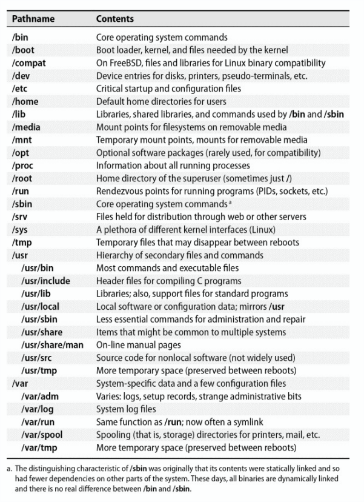
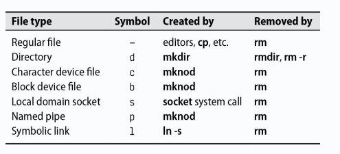

<div align="center">
  <h1 style="text-align: center;font-weight: bold">Laporan<br>Workshop Administrasi Jaringan<br></h1>
  <h4 style="text-align: center;">Dosen Pengampu : Dr. Ferry Astika Saputra, S.T., M.Sc.</h4>
</div>
<br />
<div align="center">
  
  <h3 style="text-align: center;">Disusun Oleh :</h3>
  <p style="text-align: center;">
    <strong>Hawa Kharisma Zahara (3123500010)</strong>
  </p>
<h3 style="text-align: center;line-height: 1.5">Politeknik Elektronika Negeri Surabaya<br>Departemen Teknik Informatika Dan Komputer<br>Program Studi D3 Teknik Informatika<br>2025/2026</h3>
  <hr>
</div>
<br>

---

# Bab 5: Sistem Berkas

- [Pathnames](#pathnames)
- [Filesystem Mounting and Unmounting](#filesystem-mounting-and-unmounting)
- [Pengorganisasian pohon berkas](#pengorganisasian-pohon-berkas)
- [Jenis-jenis file](#jenis-jenis-file)
- [Atribut file](#atribut-file)
- [Daftar Kontrol Akses](#daftar-Kontrol-akses)
- [Kill: mengirim sinyal](#kill-mengirim-sinyal)
- [Kesimpulan](#kesimpulan)

 

Sistem berkas berfungsi untuk merepresentasikan dan mengatur penyimpanan dalam sistem. Komponen utama sistem berkas meliputi:
Ruang nama – sistem penamaan dan hirarki data
API – panggilan sistem untuk navigasi dan manipulasi data
Model keamanan – perlindungan, penyembunyian, dan berbagi data
Implementasi – perangkat lunak yang menghubungkan sistem berkas dengan perangkat keras
Beberapa sistem berkas berbasis disk yang umum digunakan adalah ext4, XFS, UFS, ZFS, dan Btrfs. Ada juga sistem berkas asing seperti FAT, NTFS (Windows), dan ISO 9660 (CD/DVD). Sistem berkas modern berfokus pada peningkatan kecepatan, keandalan, serta fitur tambahan di atas sistem tradisional.

## Pathnames 
Dalam konteks teknis, istilah yang tepat adalah direktori, bukan folder. Nama path (pathname) menunjukkan lokasi suatu file dalam sistem berkas dan dapat berupa:
Path absolut → menunjukkan lokasi lengkap (misalnya /home/username/file.txt)
Path relatif → menunjukkan lokasi berdasarkan posisi saat ini (misalnya ./file.txt)

## Filesystem Mounting and Unmounting 
Sistem berkas terdiri dari bagian-bagian kecil yang disebut sistem berkas, yang memiliki direktori, subdirektori, dan berkas. Pohon berkas menggambarkan tata letak keseluruhan, sedangkan sistem berkas adalah cabang yang dilekatkan ke pohon tersebut menggunakan perintah mount. Perintah mount memetakan direktori di dalam pohon berkas yang ada, yang disebut titik mount, ke root dari sistem berkas yang baru.
Contoh:

    Mount the filesystem on /dev/sda4 to /users
    mount /dev/sda4 /users


Perintah umount
- umount -l → Unmount secara malas (lazy), menghapus dari hirarki tetapi tetap aktif jika masih digunakan.
- umount -f → Unmount paksa jika sistem berkas sedang sibuk.

Gunakan **lsof** untuk melihat daftar proses yang mengakses sistem berkas:

Mengetahui Proses yang Menggunakan Sistem Berkas

    Find out which processes are using the filesystem

    abdou@debian:~$ lsof /home/abdou

    COMMAND   PID USER   FD   TYPE DEVICE SIZE/OFF   NODE NAME
    bash     1000 abdou  cwd    DIR    8,1     4096  131073 /home/abdou
    bash     1000 abdou  rtd    DIR    8,1     4096  131073 /home/abdou
    bash     1000 abdou  txt    REG    8,1   103752  131072 /bin/bash
    bash     1000 abdou  mem    REG    8,1  1848400  131074 /lib/x86_64-linux-gnu/libc-2.28.so
    bash     1000 abdou  mem    REG    8,1   170864  131075 /lib/x86_64-linux-gnu/ld-2.28.so
    code     1234 abdou  cwd    DIR    8,1     4096  131073 /home/abdou
    msedge   5678 abdou  cwd    DIR    8,1     4096  131073 /home/abdou

Untuk menyelidiki proses tertentu, gunakan perintah ps:
Contoh:

    Investigate the processes that are using the filesystem

    abdou@debian:~$ ps up "1234 5678 91011"

    USER       PID %CPU %MEM    VSZ   RSS TTY      STAT START   TIME COMMAND
    abdou     1234  0.0  0.0  12345  1234 ?        Ssl  00:00   0:00 code
    abdou     5678  0.0  0.0  12345  1234 ?        Ssl  00:00   0:00 msedge
    abdou     91011  0.0  0.0  12345  1234 ?        Ssl  00:00   0:00 chrome


## Pengorganisasian pohon berkas
Sistem UNIX memiliki struktur yang kurang terorganisir dengan baik karena berbagai konvensi penamaan yang tidak kompatibel dan penyebaran berkas yang tidak teratur.
Struktur Root Filesystem
- **Root filesystem** → Berisi direktori root (/) dan berkas minimal yang dibutuhkan. Kernel OS biasanya ada di /boot, tetapi lokasinya bisa berbeda.
- **/etc*** → Menyimpan berkas sistem dan konfigurasi penting.
- **/sbin & /bin** → Berisi utilitas sistem penting.
- **/tmp** → Menyimpan berkas sementara.
- **/dev** → Dahulu bagian dari root filesystem, sekarang menjadi sistem berkas virtual yang dimuat terpisah.
- **/lib & /lib64** → Menyimpan pustaka sistem dan preprosesor C, terkadang dipindahkan ke /usr/lib dengan /lib sebagai symbolic link.

Direktori Penting Lainnya
- **/usr** → Menyimpan program standar yang tidak bersifat kritis, manual online, dan pustaka sistem. FreeBSD menyimpan konfigurasi lokal di /usr/local.

- **/var** → Berisi spool, log sistem, dan informasi yang sering berubah.

Baik **/usr** maupun **/var** harus tersedia agar sistem bisa masuk ke mode multiuser.



## Jenis-jenis file
Sebagian besar implementasi sistem berkas mendefinisikan tujuh jenis berkas:

1. File biasa
2. Direktori
3. File perangkat karakter
4. File perangkat blokir
5. Soket domain lokal
6. Pipa bernama (FIFO)
7. Tautan simbolik

Anda juga dapat menentukan jenis file dengan menggunakan perintah file (ketik man file untuk informasi lebih lanjut).

    $ file /bin/bash
    bin/bash: ELF 64-bit LSB pie executable, x86-64, version 1 (SYSV), dynamically linked, interpreter /lib64/ld-linux-x86-64.so.2, BuildID[sha1]=33a5554034feb2af38e8c75872058883b2988bc5, for GNU/Linux 3.2.0, stripped

Anda juga dapat menggunakan **ls -ld**, flag **-d** memaksa ls untuk menampilkan informasi untuk sebuah direktori dan bukan menampilkan isi direktori tersebut.

 

- File biasa → Berisi serangkaian byte tanpa struktur khusus. Contohnya: file teks, data, program, dan pustaka bersama.
- Direktori → Berfungsi sebagai referensi ke file lain.
Tautan keras (Hard Link) → Memungkinkan satu file memiliki beberapa nama. Dibuat dengan perintah ln.
Perintah ls -i → Menampilkan jumlah hard link pada setiap file

Contoh

    $ ln /etc/passwd /tmp/passwd

#### Karakter dan memblokir file perangkat

- File perangkat memungkinkan program berkomunikasi dengan perangkat keras melalui driver kernel.
- Nomor perangkat mayor dan minor → Mayor menentukan driver, minor menunjukkan unit perangkat fisik.
Contoh: /dev/tty0 (port serial pertama) memiliki mayor 4, minor 0.
- Direktori /dev kini dikelola otomatis oleh kernel, bukan dibuat manual dengan mknod.

Komunikasi Antarproses
- Soket domain lokal → Mirip dengan soket jaringan, tapi terbatas pada satu host.
Contoh: Syslog dan X Window System menggunakannya.
- Pipa bernama → Memungkinkan komunikasi antarproses dalam satu host.

Tautan dalam Sistem Berkas
- Tautan simbolik (Soft Link) → Mengacu pada file berdasarkan nama, lebih fleksibel dari hard link.
Bisa mengarah ke file di sistem berkas lain dan bisa menunjuk ke direktori.
Contoh: 

        ln -s /bin /usr/bin

        ls -l /usr/bin
        lrwxrwxrwx 1 root root 4 Mar  1  2020 /usr/bin -> /bin

## Atribut file

Setiap file memiliki 9 bit hak akses yang menentukan izin membaca (r), menulis (w), dan mengeksekusi (x) untuk pemilik, grup, dan lainnya. Ditambah 3 bit khusus, yang memengaruhi eksekusi program, membentuk 12 bit mode file. 

Kedua belas bit mode ini disimpan bersama dengan empat bit informasi tipe file. Empat bit tipe file ditetapkan ketika file dibuat dan tidak dapat diubah, tetapi pemilik file dan superuser dapat memodifikasi dua belas bit mode dengan perintah chmod.

 

### Bit izin

Bit Izin dibagi dalam 3 kelompok:

- u (user/pemilik)
- g (group/grup)
- o (others/orang lain)

Notasi Oktal:

- Pemilik: 400, 200, 100
- Grup: 40, 20, 10
- Orang lain: 4, 2, 1

Arti Bit Izin pada File:

- Read (r): Membaca file
- Write (w): Mengedit atau memotong file
- Execute (x): Menjalankan file (biner atau skrip)

Skrip harus memiliki shebang (#!) untuk menentukan interpreter:

	 #!/usr/bin/perl

Arti Bit Izin pada Direktori:

- Execute (x): Mengizinkan akses ke direktori
- Read + Execute: Melihat isi direktori
- Write + Execute: Menambah, menghapus, atau mengganti file dalam direktori.

#### Bit setuid dan setgid
- Bit Setuid (4000):
Saat file dieksekusi, pengguna sementara menjadi pemilik file.

- Bit Setgid (2000):
Saat file dieksekusi, grup sementara menjadi grup file.
Pada direktori, file baru akan memiliki grup yang sama dengan direktori, bukan grup default pengguna.
Mempermudah berbagi file dalam kelompok pengguna.

####  The sticky bit.
Bit dengan nilai oktal 1000 adalah sticky bit. Ketika diatur pada sebuah direktori, sticky bit mencegah pengguna menghapus atau mengganti nama file yang bukan miliknya. Ini berguna untuk direktori seperti /tmp yang digunakan bersama oleh banyak pengguna.

#### ls: membuat daftar dan memeriksa file

- ls – Menampilkan daftar file dan direktori.

    ls -l: Menampilkan informasi detail termasuk mode file, jumlah hard link, pemilik, grup, ukuran, dan waktu modifikasi.

Contoh untuk file perangkat:

    $ ls -l /dev/tty0
    crw--w---- 1 root tty 4, 0 Mar  1  2020 /dev/tty0


c: Menunjukkan file perangkat karakter.
4, 0: Nomor perangkat mayor dan minor.

**chmod – Mengubah hak akses file.**

 

Contoh-contoh dari sintaks mnemonic chmod:

| Specifier | Meaning |
| --- | --- |
| `u+w` | Add write permission for the file's owner |
| `ug=rw,o=r` | Gives r/w permission to owner and group, and r permission to others |
| `a-x` | Remove execute permission for all users |
| `ug=srx, o=` | Set the setuid, setgid, and sticky bits for owner and group (r/x) |
| `g=u` | Make the group's permissions the same as the owner's |
Notasi simbolik:


**chown – Mengubah pemilik dan grup file.**


chown -R pengguna:grup direktori → Mengubah kepemilikan secara rekursif.

    chown -R abdou:users /home/abdou  


**chgrp – Mengubah grup file.**


chgrp -R grup direktori → Mengubah grup secara rekursif.

 chgrp -R users /home/abdou  


**umask – Menentukan izin default file/direktori baru.**


Nilai umask dikurangkan dari izin default untuk menentukan izin aktual.

Contoh:

   ```bash
    $ umask 022
```

 | Octal | Binary | Perms |
| --- | --- | --- |
| 0 | 000 | --- |
| 1 | 001 | --x |
| 2 | 010 | -w- |
| 3 | 011 | -wx |
| 4 | 100 | r-- |
| 5 | 101 | r-x |
| 6 | 110 | rw- |
| 7 | 111 | rwx |   

Sebagai contoh, umask 027 mengizinkan rwx untuk pemilik, rx untuk grup, dan tidak ada izin untuk orang lain.


## Daftar Kontrol Akses


Model perizinan Unix tradisional efektif tetapi memiliki keterbatasan, seperti tidak bisa menetapkan beberapa pemilik pada satu file atau memberikan izin berbeda kepada kelompok pengguna tertentu.

Access Control Lists (ACL) memperluas model perizinan Unix tradisional dengan memungkinkan:
- Beberapa pemilik pada satu file.
- Izin yang berbeda untuk kelompok pengguna pada file yang berbeda.

Elemen dalam ACL:
- ACE (Access Control Entry): Setiap aturan dalam ACL yang terdiri dari:
- Penentu pengguna/grup → Bisa berupa nama pengguna, grup, atau kata kunci khusus seperti pemilik atau lainnya.
- Topeng izin → Sekumpulan izin (baca, tulis, eksekusi).
- Tipe ACE → Izinkan atau Tolak.

Perintah ACL:
Menampilkan ACL sebuah file:

 	getfacl /etc/passwd

Menetapkan izin ACL pada file:

    setfacl -m u:abdou:rw /etc/passwd  

Jenis ACL:
- ACL POSIX → ACL tradisional di Unix/Linux.
- ACL NFSv4 → Versi lebih modern dan fleksibel.


### Implementasi ACL 

ACL dapat diterapkan oleh berbagai komponen sistem, seperti:
- Kernel → Mengelola ACL untuk semua sistem berkas.
- Sistem Berkas → Setiap sistem berkas menangani ACL secara independen.
- Perangkat Lunak Tingkat Lebih Tinggi → Misalnya, server NFS dan SMB yang menangani ACL secara khusus.

### POSIX ACLs

POSIX ACLs adalah ACL tradisional dalam sistem Unix. ACL ini didukung oleh sebagian besar sistem operasi mirip Unix, termasuk Linux, FreeBSD, dan Solaris.
Entri yang dapat muncul dalam POSIX ACLs:

| Format | Example | Sets permissions for |
| --- | --- | --- |
| `user::perms` | `user:rw-` | The file's owner |
| `user:username:perms` | `user:abdou:rw-` | The user named `username` |
| `group::perms` | `group:r-x` | The file's group |
| `group:groupname:perms` | `group:users:r-x` | The group named `groupname` |
| `mask::perms` | `mask::rwx` | The maximum permissions |
| `other::perms` | `other::r--` | Everyone else |

contoh:

```bash

$ setfacl -m user:abdou:rwx,group:users:rwx,other::r /home/abdou

$ getfacl --omit-header /home/abdou

user::rwx
user:abdou:rwx
group::r-x
group:users:r-x
mask::rwx
other::r--
```


### NFSv4 ACLs

NFSv4 ACL adalah versi ACL yang lebih canggih dibandingkan POSIX ACL. Didukung oleh Linux dan FreeBSD, NFSv4 ACL memiliki fitur tambahan, seperti ACL default yang secara otomatis menetapkan izin untuk file dan direktori baru.


# Kesimpulan
- Sistem file di Unix dan Linux mendukung berbagai jenis berkas, termasuk berkas biasa, direktori, perangkat karakter dan blok, serta tautan simbolik. Setiap berkas memiliki hak akses yang menentukan siapa yang dapat membaca, menulis, atau mengeksekusinya.  

- Model izin tradisional Unix menggunakan bit izin untuk pemilik, grup, dan pengguna lain. Namun, untuk kontrol yang lebih fleksibel, Access Control Lists (ACL) memungkinkan pengaturan izin yang lebih kompleks, seperti menetapkan beberapa pemilik atau memberikan izin berbeda kepada berbagai grup pengguna.  

- Dua jenis utama ACL adalah POSIX ACL, yang merupakan standar Unix lama, dan NFSv4 ACL, yang lebih mutakhir dengan fitur tambahan seperti ACL default. Pengelolaan izin ini dapat dilakukan menggunakan perintah seperti chmod, chown, chgrp, getfacl, dan setfacl.


