

  <h1 style="text-align: center;font-weight: bold">Laporan Workshop Administrasi Jaringan </h1>
  <h4 style="text-align: center;">Dosen Pengampu : Dr. Ferry Astika Saputra, S.T., M.Sc.</h4>

 

  
  <h3 style="text-align: center;">Disusun Oleh :</h3>
  

    <strong>Hawa Kharisma Zahara (3123500010)</strong>
  

<h3 style="text-align: center;line-height: 1.5">Politeknik Elektronika Negeri Surabaya Departemen Teknik Informatika Dan Komputer Program Studi D3 Teknik Informatika 2025/2026</h3>
  

 

---

Instalisasi Debian dan Oracle Virtual Box di Linux

Solve LAN Wired Not Connected

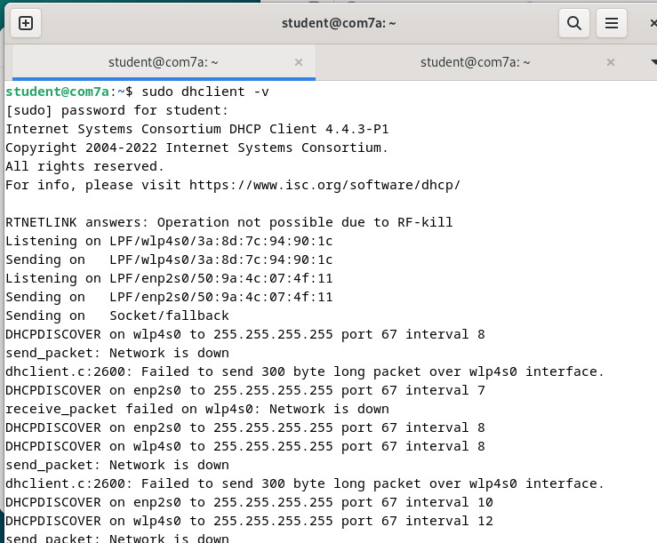

Perintah sudo dhclient -v digunakan untuk meminta atau memperbarui alamat IP dari server DHCP (Dynamic Host Configuration Protocol).

Clone Github

Install git

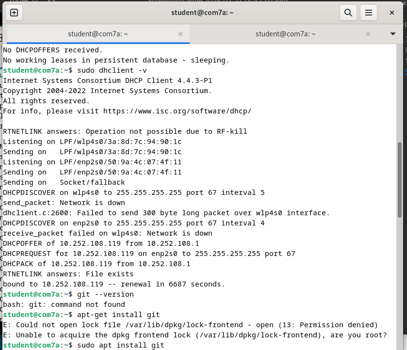

sudo apt install git
Perintah sudo apt install git digunakan untuk menginstal Git pada sistem berbasis Debian/Ubuntu menggunakan APT (Advanced Package Tool).

Setelah instalasi, bisa cek apakah Git sudah terpasang dengan:
git --version

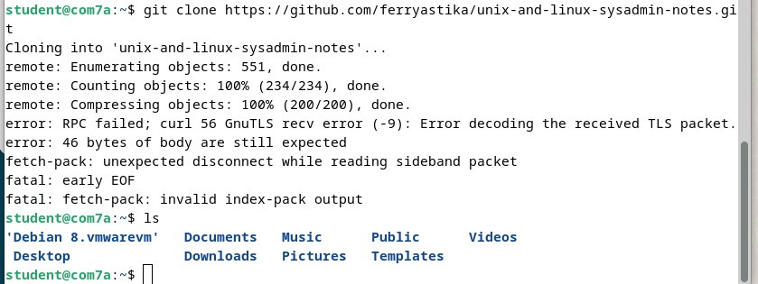

Selanjutnya melakukan git clone dengan perintah dibawah ini

git clone https://github.com/ferryastika/unix-and-linux-sysadmin-notes.git

Cek OS

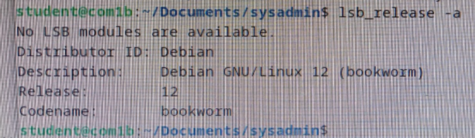
Perintah lsb_release -a digunakan untuk menampilkan informasi lengkap tentang sistem operasi Linux yang sedang digunakan.

Download VirtualBox 

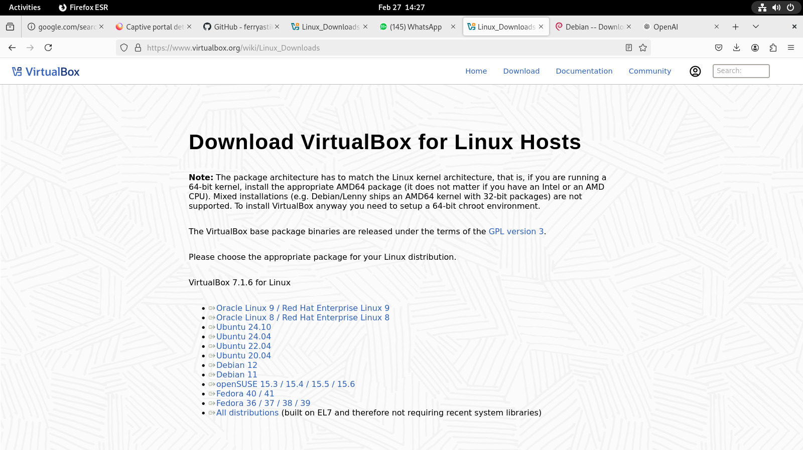
https://www.virtualbox.org/wiki/Linux_Downloads
Download Virtual sesuai dengan OS yang digunakan. Saat ini komputer yang saya pakai menggunakan OS 12 jadi unduh Debian 12.

Download ISO Debian 12
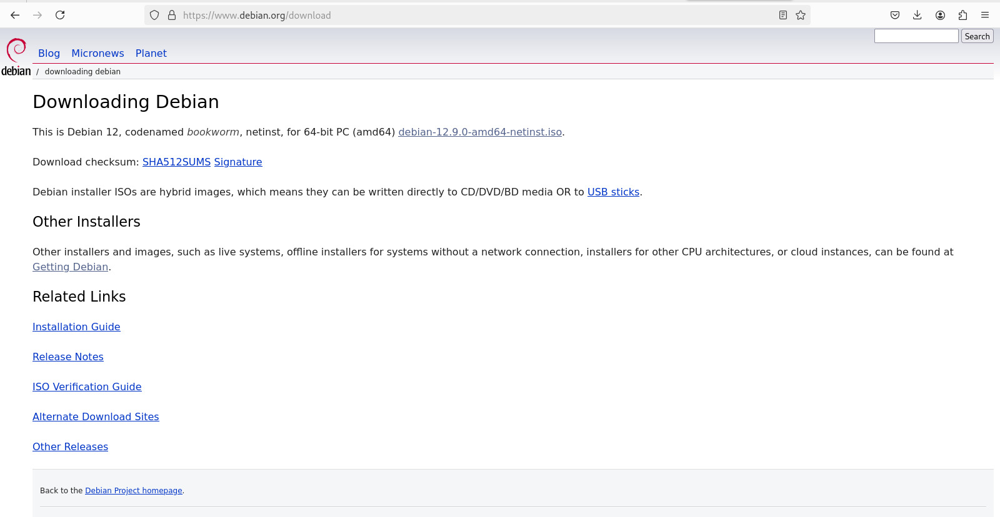

https://www.debian.org/download
ISO di VirtualBox adalah file image disk yang digunakan untuk menginstal atau menjalankan sistem operasi tanpa CD/DVD fisik. File ini berguna untuk instalasi OS, booting Live OS, serta recovery & maintenance. 

Install VirtualBox

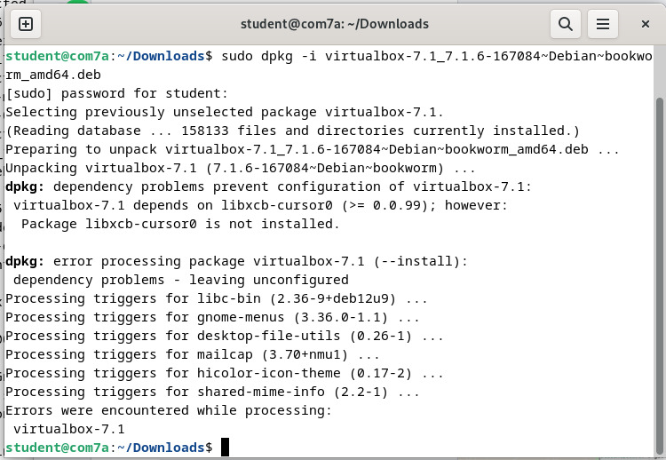

sudo dpkg -i virtualbox-7.1_7.1.6-167084~Debian~bookworm_amd64.deb

Perintah diatas digunakan untuk menginstal paket VirtualBox secara manual menggunakan dpkg di sistem berbasis Debian.

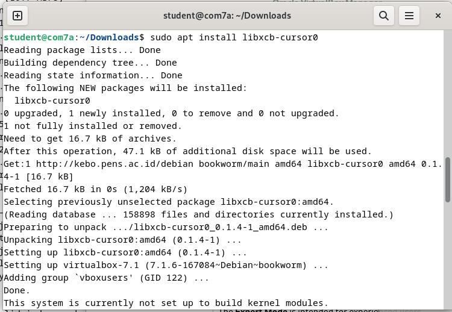

sudo apt install libxcb-cursor0
Perintah diatas digunakan untuk menginstal pustaka libxcb-cursor0 di sistem berbasis Debian/Ubuntu

Solving Error VirtualBox
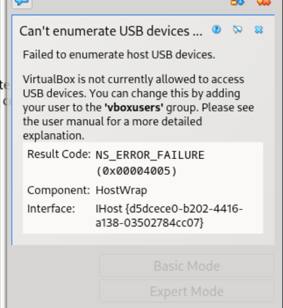

Solve error diatas menggunakakn perintah:

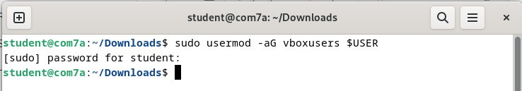

Perintah diatas digunakan untuk menambahkan pengguna ke grup vboxusers agar dapat menggunakan fitur USB di VirtualBox.

Oracle VirtualBox Manager

Membuat New Virtual Machine, berikut:

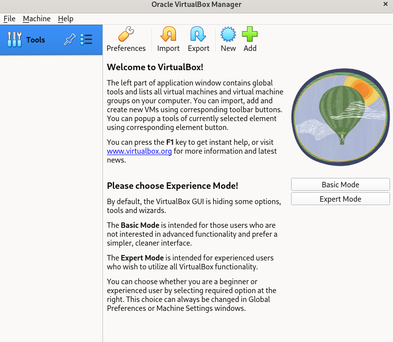

Pertama mengatur nama, lokasi penyimpanan, serta memilih file ISO untuk instalasi. 

Kedua, mengatur username, password, hostname, dan domain. 

Ketiga, mengatur spesifikasi RAM dan CPU seperti dibawah ini.

 Selanjutnya, menentukan konfigurasi hard disk virtual

Terakhir, dapat meninjau kembali konfigurasi yang telah dipilih sebelum menekan tombol "Finish" untuk memulai proses pembuatan. Jika sudah sesuai, maka klik Finish.

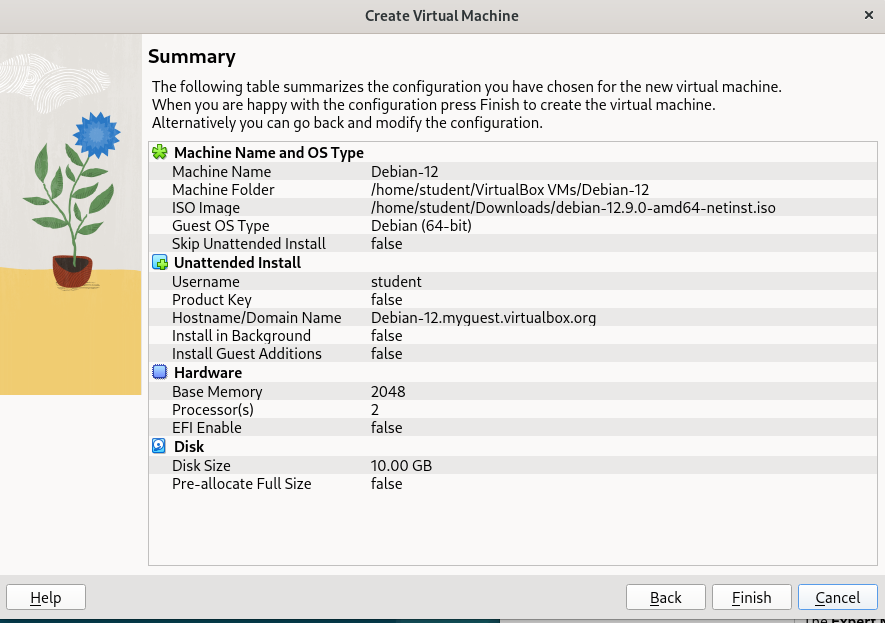

Kernel Error

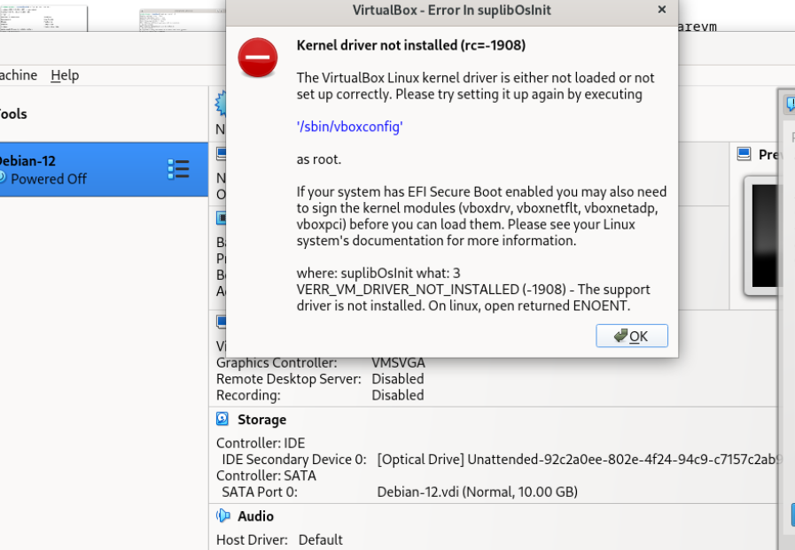

Gunakan perintah berikut untuk memperbaiki error pada kernel:
sudo apt update
sudo apt install dkms build-essential linux-headers-$(uname -r)
sudo /sbin/vboxconfig

Run Virtual Machine

Jalankan proses instalasi dan tunggu hingga Debian di VM terpasang serta terinisialisasi dengan sempurna.

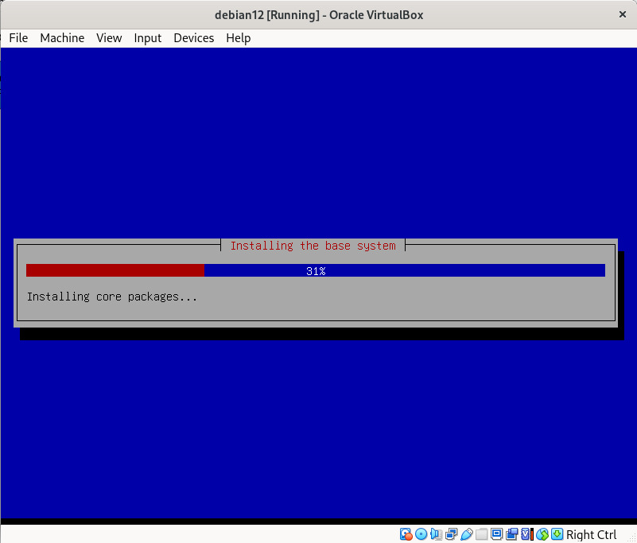
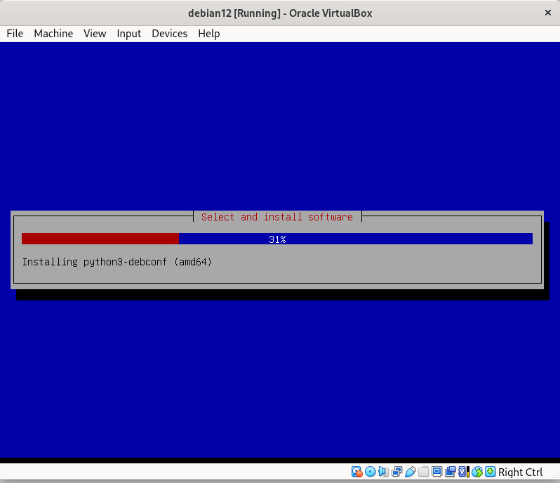

Jika tampilan sudah sesuai dengan gambar di bawah, berarti instalasi Debian 12 di VirtualBox telah berhasil.

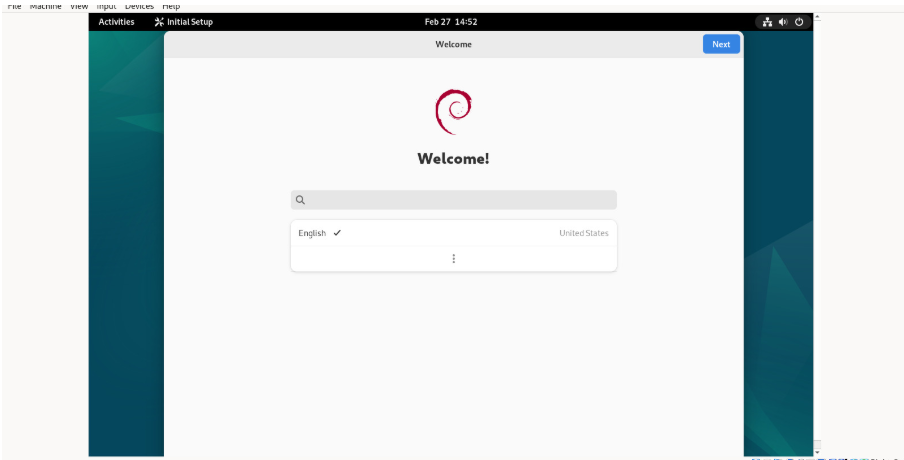

Lanjutkan dengan mengklik "Next" hingga selesai. Jika tampilan sudah seperti gambar di bawah, berarti Debian di VirtualBox siap digunakan.

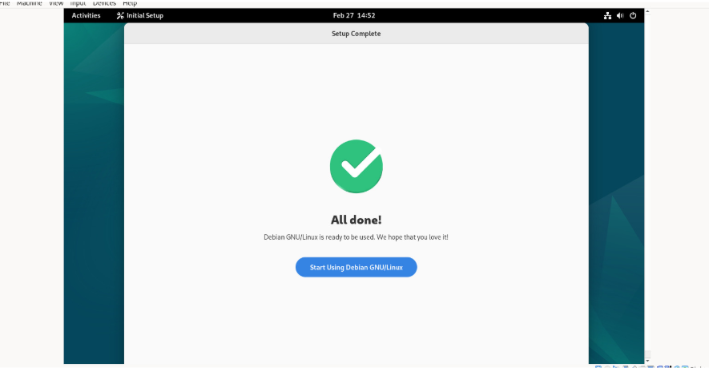

