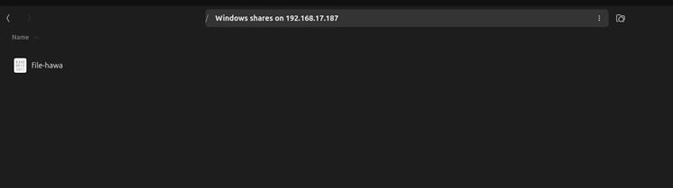
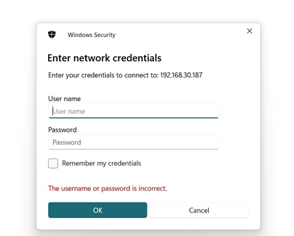
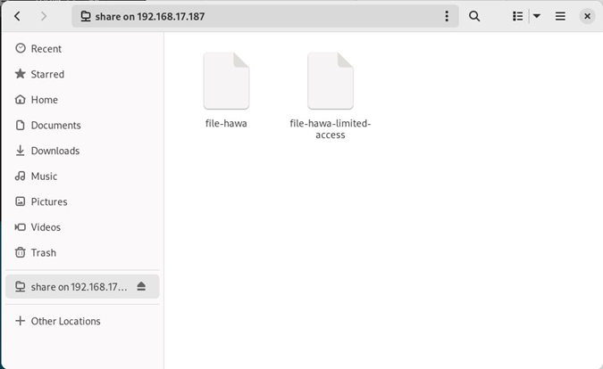

  <h1 style="text-align: center;font-weight: bold">Laporan Workshop Administrasi Jaringan </h1>
  <h4 style="text-align: center;">Dosen Pengampu : Dr. Ferry Astika Saputra, S.T., M.Sc.</h4>

 

  
  <h3 style="text-align: center;">Disusun Oleh :</h3>
  

    <strong>Hawa Kharisma Zahara (3123500010)</strong>
  

<h3 style="text-align: center;line-height: 1.5">Politeknik Elektronika Negeri Surabaya Departemen Teknik Informatika Dan Komputer Program Studi D3 Teknik Informatika 2025/2026</h3>
  

 

---

### Daftar Isi

1. [Install dan Konfigurasi Network Time Protocol](#a-instalasi-ntp-client)
2. [Instalasi dan Konfigurasi Samba](#b-instalasi-dan-konfigurasi-samba)
3. [Package Management](#c-rangkuman-tentang-package-management)

## A. Instalasi NTP Client 

  Network Time Protocol (NTP) NTP Client (Network Time Protocol Client) adalah perangkat keras atau perangkat lunak yang digunakan untuk menyinkronkan waktu sistem dengan server waktu melalui protokol NTP. Protokol ini berfungsi untuk memastikan jam komputer tetap akurat dengan menyelaraskannya melalui jaringan, biasanya dengan tingkat presisi hingga milidetik.

**Langkah - langkah**

1. Instalasi package NTP NTPsec	

    

2. Menyesuaikan konfigurasi pool dengan NTP Server Indonesia

    
    

3. Periksa sinkronisasi

    

## B. Instalasi dan konfigurasi Samba 

Samba merupakan perangkat lunak open-source yang berfungsi untuk berbagi file dan printer antara sistem operasi Windows dengan sistem berbasis Unix seperti Linux dan macOS. Samba menggunakan protokol SMB/CIFS (Server Message Block/Common Internet File System), yang banyak digunakan dalam jaringan Windows untuk keperluan berbagi sumber daya. Berikut ini adalah langkah-langkah konfigurasinya.

**Instalasi package Samba**

  

**Percobaan fully access**

1. Konfigurasi pada samba

    
    
    

2. Membuat sebuah file di direktori /home/share

    

    menambahkan pesan

    

3. Percobaan akses dari Host

    

4. Percobaan akses di komputer lain

    
    

**Percobaan Limited Access**

1. Konfigurasi pada samba

    
    

2. Membuat sebuah file untuk dibagikan di direktori /home/share01

    

3. Menambahkan user baru

    

4. Menambahkan group baru serta menambahkan user ke group hawaoke

    

5. Menambahkan user valid baru ke samba
  
    

6.  Menambahkan pesan

    

7. Percobaan akses di host

    

8. Percobaan akses di komputer lain (Windows)

    
    
    

**Percobaan akses lewat CLI**

  
  

**Mengakses via file manager**

  

## C. Rangkuman tentang package management.

**Package Management**

  Package manager merupakan perangkat lunak yang berfungsi untuk mengelola berbagai paket dalam suatu proyek. Peran utamanya adalah menyederhanakan proses mengunduh, menginstal, memperbarui, serta menghapus paket yang diperlukan. Pada sistem operasi Debian, terdapat beberapa alat untuk manajemen paket. Berdasarkan cara penggunaannya, paket dapat dikelola melalui antarmuka grafis (GUI) maupun baris perintah (CLI).

**Advanced Package Tool (APT)**

  Berikut ini adalah perintah dasar untuk mengelola paket pada Debian menggunakan APT (Advanced Package Tool) melalui terminal.

  - Perintah "User" untuk Mencari dan Menampilkan Informasi
      - apt show foo: Menampilkan detail informasi mengenai paket foo.
      - apt search foo: Mencari paket yang mengandung kata kunci foo.
      - apt-cache policy foo: Menampilkan versi foo yang tersedia di repositori.

  - Perintah "Administrator" untuk mengelola sistem
    Perintah berikut memerlukan hak akses administrator karena berpengaruh pada sistem. Untuk beralih ke mode root, jalankan su - lalu masukkan kata sandi administrator.
      - apt update: Memperbarui metadata repositori agar daftar paket tetap terbaru.
      - apt install foo: Menginstal paket foo beserta semua dependensinya.
      - apt upgrade: Memperbarui semua paket yang sudah terpasang tanpa menghapus paket lain.
      - apt full-upgrade: Memperbarui seluruh sistem, termasuk menambah atau menghapus paket jika diperlukan.
      - apt remove foo: Menghapus paket foo, tetapi tetap mempertahankan file konfigurasinya.
      - apt autoremove: Menghapus paket yang tidak lagi dibutuhkan oleh sistem.
      - apt purge foo: Menghapus paket foo beserta semua file konfigurasinya.
      - apt clean: Menghapus cache paket yang telah diunduh sebelumnya.
      - apt autoclean: Menghapus cache paket lama yang sudah tidak tersedia di repositori.
      - apt-mark showmanual: Menampilkan daftar paket yang diinstal secara manual oleh pengguna.

  Jika ingin memperbarui sistem sekaligus membersihkan cache dalam satu langkah, jalankan:

    apt update && apt full-upgrade && apt autoclean

  Sedangkan untuk menghapus paket yang tidak terpakai, termasuk dependensinya dan file konfigurasi yang tersisa, gunakan:

    apt autoremove --purge

**Software (Simplified Package Manager)**

  Software adalah manajer paket pada sistem operasi Debian yang berfungsi untuk mengelola instalasi, pembaruan, dan penghapusan aplikasi. Dengan antarmuka grafis (GUI), alat ini dirancang agar lebih mudah digunakan, terutama bagi pengguna yang tidak terbiasa dengan perintah terminal.

  

**Discover: KDE package Manager**

  Discover adalah manajer paket yang dirancang untuk lingkungan desktop K Desktop Environment (KDE), menyediakan antarmuka grafis (GUI) yang kaya fitur dan mudah digunakan. Melalui KDE, pengguna dapat mengakses sistem menggunakan elemen visual seperti jendela, ikon, menu, dan panel, yang membuat navigasi serta manajemen aplikasi menjadi lebih sederhana.

   

  Dengan Discover, pengguna dapat mencari, menginstal, memperbarui, dan menghapus paket di Debian dengan mudah. Selain itu, alat ini juga memungkinkan pengguna untuk mengelola dan memodifikasi repositori sesuai kebutuhan.

**Synaptic: Comprehensive Package Manager**

  Synaptic merupakan salah satu manajer paket yang dapat memberikan informasi lebih rinci mengenai paket-paket yang telah terinstal.

  

  Tampilan Synaptic terdiri dari empat area dengan fungsi yang berbeda. 
  - Panel di sebelah kiri digunakan untuk menyortir dan memilih paket yang ingin dikelola. 
  - Panel tengah menampilkan informasi terkait paket, 
  - Bagian bawah berisi deskripsi dari paket tersebut. 
  - Paket yang memiliki logo Debian menandakan bahwa perangkat lunak tersebut tersedia secara gratis.

  Sebelum menggunakan Synaptic, langkah awal yang perlu dilakukan adalah menekan tombol Reload untuk memperbarui informasi metadata. Seperti manajer paket lainnya, Synaptic memungkinkan pengguna untuk mencari, menginstal, memperbarui, menghapus paket, serta mengelola repositori sesuai kebutuhan.

**Instalasi paket dengan Gdebi**

  

  Saat pengguna ingin menginstal paket dari sumber eksternal, paket yang dapat dipasang harus memiliki ekstensi .deb. Ada beberapa metode untuk menginstal paket dengan format tersebut, salah satunya adalah menggunakan Gdebi. Berikut adalah contoh tampilan saat melakukan instalasi paket menggunakan Gdebi.

**Instalasi paket dengan Dpkg**

  Metode lain untuk menginstal paket berformat .deb adalah dengan menggunakan Dpkg melalui terminal. Melalui terminal, pengguna dapat memantau proses instalasi secara langsung, sehingga lebih mudah untuk mengidentifikasi penyebab kesalahan jika terjadi masalah.
