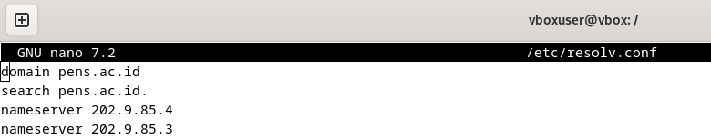
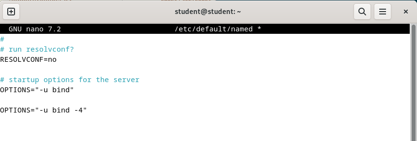

  <h1 style="text-align: center;font-weight: bold">Laporan Workshop Administrasi Jaringan </h1>
  <h4 style="text-align: center;">Dosen Pengampu : Dr. Ferry Astika Saputra, S.T., M.Sc.</h4>

 

  
  <h3 style="text-align: center;">Disusun Oleh :</h3>
  

    <strong>Hawa Kharisma Zahara (3123500010)</strong>
  

<h3 style="text-align: center;line-height: 1.5">Politeknik Elektronika Negeri Surabaya Departemen Teknik Informatika Dan Komputer Program Studi D3 Teknik Informatika 2025/2026</h3>
  

 

## Daftar Isi

1. [Ekosistem Internet dan DNS Concept](#ekosistem-internet-dan-dns-concept)
2. [Hirarki DNS](#hirarki-dalam-dns)
3. [Cara Kerja DNS](#cara-kerja-dns)
3. [Instalasi dan Konfigurasi bind9](#instalasi--konfigurasi-bind9) 
4. [Konfigurasi Zone Files](#konfigurasi-zone-files)
5. [Verify Resolution](#bind-verify-resolution)
6. [Referensi](#referensi)

## Ekosistem Internet dan DNS Concept

#### Name Service Switch (NSS) - /etc/nsswitch.conf

File `/etc/nsswitch.conf` pada sistem Linux, termasuk Debian, digunakan untuk mengatur Name Service Switch (NSS). NSS adalah mekanisme yang menentukan sumber data yang digunakan sistem untuk mencari informasi seperti pengguna, grup, host, layanan jaringan, dan lain-lain.  

Dalam file ini, setiap jenis pencarian memiliki entri yang menunjukkan urutan sumber data yang akan diperiksa, misalnya:  

- **passwd** → Menentukan sumber informasi akun pengguna (misalnya dari file `/etc/passwd` atau layanan direktori seperti LDAP).  
- **group** → Menentukan sumber data grup pengguna (misalnya dari `/etc/group` atau NIS).  
- **hosts** → Mengatur cara pencarian nama host, apakah melalui `/etc/hosts`, DNS, atau metode lain.  
- **networks, services, protocols** → Menentukan sumber informasi jaringan.  

Dengan mengonfigurasi `/etc/nsswitch.conf`, sistem dapat mengoptimalkan pencarian data dan mengintegrasikan berbagai sumber informasi sesuai kebutuhan.

#### File /etc/hosts

File /etc/hosts pada sistem Linux digunakan untuk memetakan alamat IP ke nama host secara lokal tanpa harus mengandalkan DNS. File ini berisi daftar alamat IP dan nama host yang sesuai, memungkinkan sistem untuk menemukan nama host tertentu tanpa melakukan kueri ke server DNS.

Untuk mengonfigurasi alamat IP dalam file /etc/hosts agar komputer dapat mengenali nama host, ikuti langkah-langkah berikut:

1. Buka File /etc/hosts 

    

2. Tambahkan Entri untuk ul

    Tambahkan baris berikut dan ganti dengan alamat IP komputer yang ingin dihubungkan, dan sesuaikan nama. Disini saya memakai ip add 10.252.108.118 dengan nama ul

    

3. Uji Koneksi dengan ping

    

    Jika ping berhasil, artinya konfigurasi berfungsi.

#### Cek IP

Gunakan command ip a

 

 #### resolv

 Sedangkan isi dari file resolv.conf sendiri bisa dicek menggunakan command

    sudo less /etc/resolv.conf

`nameserver` menentukan alamat IP server DNS yang digunakan untuk mencari domain. Bisa berisi lebih dari satu alamat, yang akan dicoba secara berurutan jika yang pertama gagal. Sementara itu, `search` menetapkan domain yang akan ditambahkan saat hanya sebagian nama host diberikan.

#### Test ping www

Konfigurasi dalam `/etc/resolv.conf` berperan dalam proses resolusi domain melalui dua direktif utama. Direktif `search pens.ac.id` memungkinkan sistem menambahkan domain **pens.ac.id** ke host yang tidak lengkap, sehingga saat menjalankan perintah `ping www`, sistem secara otomatis mencoba **ping www.pens.ac.id**. Sementara itu, **nameserver 202.9.85.4** dan **nameserver 202.9.85.3** digunakan jika domain tidak ditemukan secara lokal. Dalam situasi ini, sistem akan mengandalkan server DNS tersebut untuk mengonversi nama domain menjadi alamat IP.

#### root.hints

File `/usr/share/dns/root.hints` berisi daftar server DNS root yang berfungsi sebagai referensi bagi resolver DNS rekursif dalam menemukan server otoritatif untuk suatu domain. File ini umumnya digunakan oleh server DNS lokal seperti **BIND**, **Unbound**, atau **PowerDNS** untuk memulai pencarian domain yang tidak terdapat dalam cache atau zona lokal.

## Hirarki dalam DNS

DNS disusun dalam struktur hierarki seperti pada gambar berikut. Pada tingkat paling atas terdapat root, yang dalam DNS dikenal sebagai **Top-Level Domains (TLDs)**. TLDs diklasifikasikan ke dalam empat kategori, yaitu **Country-code TLDs (ccTLDs), Generic TLDs (gTLDs), Infrastructure TLD,** dan **Internationalized TLDs (IDN)**. Contoh TLDs antara lain **.com, .arpa, .id, .jp**, dan lainnya. Di bawah TLDs terdapat **subdomain**, yang juga dapat memiliki subdomain tambahan untuk struktur yang lebih spesifik.

## Cara Kerja DNS

1. Komputer client mencari www.example.com.au kepada 192.168.1.53.
2. Karena 192.168.1.53 tidak mengetahui domain tersebut sehingga dialihkan ke root.
3. Root memberitahukan kepada 192.168.1.53 untuk bertanya ke a.b.c.d.
4. Selanjutnya 192.168.1.53 akan mencari domain kepada a.b.c.d.
5. Karena a.b.c.d hanya mengetahui (.au), maka mengarahkan 192.168.1.53 untuk mencari domain ke e.f.g.h.
6. Selanjutnya 192.168.1.53 akan mencari domain kepada e.f.g.h.
7. Karena e.f.g.h hanya mengetahui (.com.au), maka mengarahkan 192.168.1.53 untuk mencari domain ke i.j.k.l.
8. Selanjutnya 192.168.1.53 akan mencari domain kepada i.j.k.l.
9. Karena i.j.k.l mengetahui (.example.com.au), maka memberikan konfirmasi ke 192.168.1.53 bahwa domain tersebut ditemukan.
10. Selanjutnya 192.168.1.53 juga memberi konfirmasi kepada 192.168.1.100 (client)
11. Setelah beberapa step tersebut maka, client sudah menemukan domain yang dicari, yaitu www.example.com.au pada m.n.o.p

---

## Instalasi & Konfigurasi bind9

#### Konfigurasi Jaringan Internal

Install bind9

#### Konfigurasi dan Penyesuaian BIND

Menambahkan file konfigurasi baru **named.conf.internal-zones** ke dalam file utama konfigurasi BIND yang terletak di **/etc/bind/named.conf**.

#### Konfigurasi pada /etc/bind/named.conf.options

Konfigurasi **ACL internal-network** untuk jaringan **192.168.100.0/24** mengatur akses ke layanan DNS. Hanya **localhost** dan jaringan internal yang diizinkan untuk melakukan **query (allow-query)**, sedangkan **transfer zona (allow-transfer)** hanya diperbolehkan untuk **localhost**. Resolusi domain eksternal diaktifkan melalui **pencarian rekursif (recursion yes)**, validasi **DNSSEC** dikonfigurasi secara otomatis **(dnssec-validation auto)**, dan **BIND** disetel untuk menerima koneksi **IPv6** dengan **(listen-on-v6 { any; })**.

#### Konfigurasi Zona DNS di BIND

1. **Zona Forward (kelompok5.home)**  
Zona ini berfungsi untuk mengonversi nama domain menjadi alamat IP dan datanya tersimpan dalam **/etc/bind/kelompok5.home.lan**. Berperan sebagai **master (utama)**, sehingga server ini menjadi sumber resmi informasi **DNS** untuk domain tersebut. Selain itu, **pembaruan dinamis tidak diperbolehkan** dengan konfigurasi **allow-update { none; };**.  

2. **Zona Reverse (100.168.192.in-addr.arpa)**  
Zona ini digunakan untuk **menerjemahkan alamat IP menjadi nama domain (reverse lookup)** dengan data yang disimpan dalam **/etc/bind/100.168.192.db**. Sama seperti zona forward, zona ini juga berperan sebagai **master**, dengan **update dinamis yang dinonaktifkan**.

#### Konfigurasi opsi BIND untuk menggunakan hanya IPv4 dan menonaktifkan IPv6.

Untuk mengonfigurasi BIND agar hanya menggunakan IPv4, edit file /etc/default/named dan tambahkan opsi OPTIONS="-u bind -4". Opsi ini memastikan BIND berjalan sebagai pengguna bind dan hanya menggunakan IPv4, mengabaikan IPv6 untuk menghindari kemungkinan error pada jaringan yang tidak mendukung IPv6.

### Konfigurasi Zone Files

Konfigurasi **forward lookup** pada **BIND DNS Server** untuk jaringan **192.168.100.0/24** dengan domain **kelompok5.home** memungkinkan server memetakan nama domain ke alamat IP dengan menetapkan file zona sebagai **master** serta mendefinisikan pemetaan nama host.

Konfigurasi **reverse lookup** pada **BIND DNS Server** untuk jaringan **192.168.100.0/24** dengan domain **kelompok5.home** dilakukan dengan membuat file zona **/etc/bind/100.168.192.db**, menetapkannya sebagai **master** di **/etc/bind/named.conf.local**, kemudian melakukan verifikasi dan merestart **BIND** agar perubahan dapat diterapkan.

### BIND: Verify Resolution

Restart BIND untuk menerapkan perubahan dengan command

#### Konfigurasi DNS Client untuk menggunakan DNS Server sendiri

File **/etc/resolv.conf** pada sistem **Linux** berfungsi untuk menentukan **DNS server** yang digunakan dalam proses **query DNS**, baik untuk menerjemahkan domain ke **alamat IP** maupun sebaliknya.  

Dengan mengubah **nameserver** menjadi **192.168.80.193**, maka:  

- Sistem akan menggunakan **DNS Server sendiri** (BIND di **192.168.100.165**).  
- Prioritas pencarian **DNS** diarahkan ke **server lokal** sebelum mencari ke **DNS eksternal**.  
- Memungkinkan sistem mengenali dan menyelesaikan **domain lokal** yang hanya tersedia di **DNS internal**.

#### DNS Query menggunakan DiG (Domain Information Groper) untuk Forward Lookup

Perintah tersebut digunakan untuk memanfaatkan DNS Server yang telah dikonfigurasi guna memeriksa resolusi nama domain ke alamat IP.

#### Reverse DNS Lookup

Untuk mengetahui nama domain yang terkait dengan suatu alamat IP, perintah di atas dapat digunakan untuk melakukan pencarian terbalik.

--- 

#### Referensi
[Configure for Internal Network](https://www.server-world.info/en/note?os=Debian_12&p=dns&f=1)

[Configure Zone Files](https://www.server-world.info/en/note?os=Debian_12&p=dns&f=3)

[Verify Resolution](https://www.server-world.info/en/note?os=Debian_12&p=dns&f=4)

