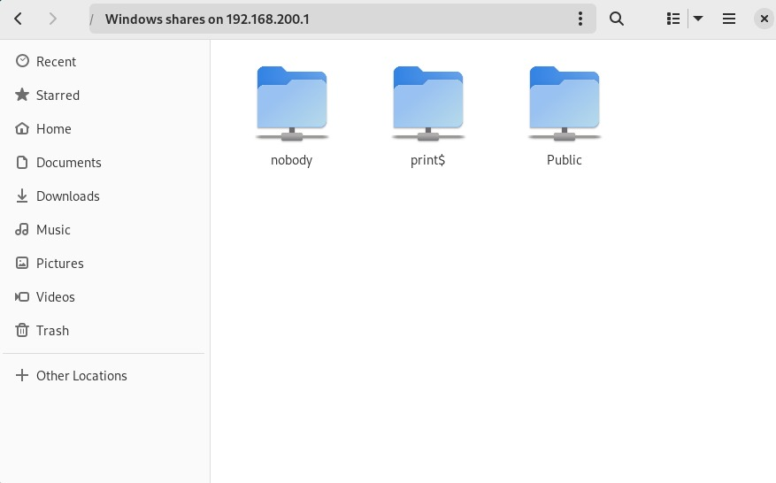

<div align="center">
  <h1 style="text-align: center;font-weight: bold">Laporan<br>Workshop Administrasi Jaringan<br></h1>
  <h4 style="text-align: center;">Dosen Pengampu : Dr. Ferry Astika Saputra, S.T., M.Sc.</h4>
</div>
<br />
<div align="center">
  
  <h3 style="text-align: center;">Disusun Oleh :</h3>
  <p style="text-align: center;">
    <strong>Hawa Kharisma Zahara (3123500010)</strong>
  </p>
<h3 style="text-align: center;line-height: 1.5">Politeknik Elektronika Negeri Surabaya<br>Departemen Teknik Informatika Dan Komputer<br>Program Studi D3 Teknik Informatika<br>2025/2026</h3>
  <hr>
</div>

-----

#### Daftar Isi
1. [Konfigurasi Virtual Machine No-GUI (VM 1)](#konfigurasi-virtual-machine-no-gui-vm-1)
2. [Konfigurasi NTP Client](#konfigurasi-ntp-client)
3. [Konfigurasi Samba](#konfigurasi-samba) 
4. [Konfigurasi Bind9 (DNS)](#konfigurasi-bind9-dns)
5. [Konfigurasi Virtual Machine GUI (VM 2)](#konfigurasi-virtual-machine-gui-vm-2)

Praktikum ini menggunakan dua VM Debian, satu tanpa GUI (VM1) dan satu dengan GUI (VM2). Tujuannya adalah menghubungkan kedua VM. VM1 memakai bridge network, sedangkan VM2 memakai internal network dan dikonfigurasi dengan Samba. 

### Konfigurasi Virtual Machine No-GUI (VM 1)

Mengatur Network pada debidora-nogui (VM 1), Ubah adapter 1 menjadi bridged network dan adapter 2 menjadi internal network. Tekan OK untuk menyimpan perubahan.


1. Jalankan perintah ip a di VM untuk melihat alamat IP, lalu catat IP dari interface enp0s3. 

    

2. Setelah itu, buka terminal atau Command Prompt di Windows host, lalu gunakan perintah ssh student@[alamat-IP-enp0s3]. Masuk seperti biasa (seperti saat login di VM) untuk mengakses VM tanpa GUI langsung dari terminal Windows.

    

3. Setelah itu, lakukan pengaturan jaringan dan periksa isinya dengan menjalankan perintah nano -l -w /etc/network/interfaces untuk melihat konfigurasi yang ada.

    

    Terlihat bahwa terdapat dua interface jaringan yang dikonfigurasi: enp0s3 yang disetel menggunakan DHCP (otomatis mendapat IP), dan enp0s8 yang dikonfigurasi secara statis dengan alamat IP 192.168.200.1, subnet mask 255.255.255.0, dan DNS 1.1.1.1. Konfigurasi ini memungkinkan sistem untuk menggunakan dua koneksi jaringan sekaligus, masing-masing dengan pengaturan berbeda.

4. Agar sistem bisa berfungsi sebagai router atau gateway, fitur IP forwarding perlu diaktifkan. Caranya adalah dengan mengedit file konfigurasi dan mengaktifkan opsi `net.ipv4.ip_forward`.

    


    lalu lakukan validasi dengan perintah `systemctl -p`

    

5. Unduh package iptables dan iptables-persistent dengan menggunakan perintah sudo apt-get install iptables iptables-persistent.

    

6. Buka file /etc/iptables/rules.v4 dengan perintah sudo nano -l -w /etc/iptables/rules.v4 lalu tambahkan baris kode berikut:

  ```bash
*nat
 -A POSTROUTING -o enp0s3 -j MASQUERADE
 COMMIT

 *filter
 -A INPUT -i lo -j ACCEPT
 # allow ssh, so that we do not lock ourselves
 -A INPUT -i enp0s3 -p tcp -m tcp --dport 22 -j ACCEPT
 # allow incoming traffic to the outgoing connections,
 # et al for clients from the private network
 -A INPUT -m state --state RELATED,ESTABLISHED -j ACCEPT
 # prohibit everything else incoming
 -A INPUT -i enp0s3 -j DROP
 COMMIT
```  


7. Jalankan perintah `iptables-restore < /etc/iptables/rules.v4` untuk mengembalikan aturan-aturan iptables dari file konfigurasi yang telah disimpan sebelumnya.

    


### Konfigurasi NTP Client

1. Instal NTP Client menggunakan perintah `apt -y install ntpsec`

    

2. Setelah proses instalasi selesai, buka file `/etc/ntpsec/ntp.conf` dengan perintah `sudo nano /etc/ntpsec/ntp.conf`, lalu beri tanda komentar (#) pada keempat baris pool yang ada dan tambahkan server NTP dari Indonesia yang bisa diperoleh melalui situs [https://www.ntppool.org/en/zone/id](https://www.ntppool.org/en/zone/id).

    

3. Setelah konfigurasi, lakukan restart NTP Client untuk menggunakan konfigurasi yang baru dengan perintah `systemctl restart ntpsec`

    

4. ntuk melihat jika sudah tersambung dengan server, gunakan perintah ntpq -p.

    

5.  Periksa waktu NTP Client dengan menggunakan perintah `systemctl status ntpsec`

    

### Konfigurasi Samba

1. unduh package samba dengan menggunakan perintah `apt -y install samba`

    

2. Membuat direktori dengan menggunaakn perintah `mkdir /home/share` dan Merubah akses agar semua dapat write, read, dan excute dengan perintah `chmod 777 /home/public`

    

3. Konfigurasi file samba menggunakan perintah `nano /etc/samba/smb.conf`

    Menambahkan unix charset = UTF-8 untuk kompatibilitas dengan sistem yang mendukung pengkodean UTF-8 dan Menambahkan interface sesuai dengan alamat IP yang akan digunakan.

    

    Menambahkan konfigurasi folder public.

    

4. Melakukan restart dengan perintah `systemctl restart smbd` dan mengcek status samba dengan `systemctl status smb`

    

5. Lakukan pengecekan akses samba dalam VM 1 yang menggunakan IP Statik [smb://192.168.200.1] dengan menggunakan VM 2.

    

###  Konfigurasi Bind9 (DNS)

1. Instalasi BIND menggunakan perintah `apt -y install bind9 bind9utils`

    

2. Konfigurasi BIND untuk network internal dalam named.conf menggunakan perintah `nano /etc/bind/named.conf` untuk menambahkan include "/etc/bind/named.conf.internal-zones";

    

3. Konfigurasi BIND untuk network internal dalam named.conf.options menggunakan perintah `nano /etc/bind/named.conf.options` untuk menambahkan:

    ```bash
            acl internal-network {
                    192.168.200.0/24;
            };
    ...
    ...
            allow-query { localhost; internal-network; };
            allow-transfer { localhost; };
            listen-on port 53 { any; };
            recursion yes;
    ```

    

4. Konfigurasi BIND untuk network internal dalam named.conf.internal-zones menggunakan perintah `nano /etc/bind//etc/bind/named.conf.internal-zones`

    

5. Konfigurasi BIND untuk network internal dalam /default/named menggunakan perintah `nano /etc/default/named` untuk menambahkan:

    ```bash
    # add
    OPTIONS="-u bind -4"
    ```
    

6. embuat file zona yang digunakan server untuk menyelesaikan alamat IP dari nama domain, menggunakan perintah `nano /etc/bind/kelompok5.home.lan`

    

7. Buat file zona yang memungkinkan server mengubah nama domain menjadi alamat IP menggunakan perintah `nano /etc/bind/200.168.192.db`

    

8. Terakhir lakukan Restart BIND untuk menyimpan perubahan menggunakan `systemctl restart named`

### Konfigurasi Virtual Machine GUI (VM 2)

1. Konfigurasi jaringan Wired menjadi IP statik seperti yang tertera pada gambar. Lalu klik apply.

    

2. Cek koneksi dengan melakukan ping ke gateway

    

3. Jika VM 2 sudah berhasil terkoneksi dengan VM 1 melalui jaringan internal, lakukan pengecekan layanan DNS di VM 2 dengan menjalankan perintah `dig ns.kelompok5.home` dan `dig -x 192.168.200.1`. DNS dianggap berhasil jika hasilnya menampilkan flag **ANSWER: 1** atau lebih serta status **NOERROR**.

    

    


