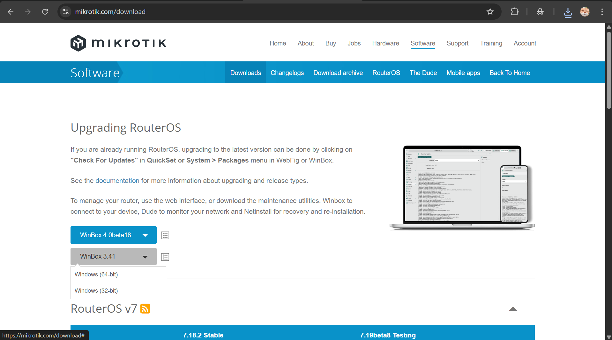

  <h1 style="text-align: center;font-weight: bold">Laporan Workshop Administrasi Jaringan </h1>
  <h4 style="text-align: center;">Dosen Pengampu : Dr. Ferry Astika Saputra, S.T., M.Sc.</h4>

 

  
  <h3 style="text-align: center;">Disusun Oleh :</h3>
  

    <strong>Hawa Kharisma Zahara (3123500010)</strong>
  

<h3 style="text-align: center;line-height: 1.5">Politeknik Elektronika Negeri Surabaya Departemen Teknik Informatika Dan Komputer Program Studi D3 Teknik Informatika 2025/2026</h3>
  

-----

### Daftar Isi
1. [Tugas](#tugas) 
2. [Konfigurasi Mikrotik](#konfigurasi-mikrotik) 

## Tugas

- Pada tahap awal konfigurasi berdasarkan skema  diatas, dilakukan penyambungan antar perangkat MikroTik dari masing-masing kelompok. Tujuan dari langkah ini adalah memastikan bahwa setiap laptop yang tergabung dalam jaringan LAN dapat saling terhubung dan berkomunikasi, terutama dalam melakukan uji koneksi (ping) ke alamat IP kelompok lain.

- Untuk melakukan pengujian tersebut, salah satu laptop dari tiap kelompok perlu tersambung ke jaringan LAN, lalu menjalankan perintah ping untuk menguji konektivitas antar jaringan. Dalam percobaan ini, digunakan rentang IP 10.252.108.5x, di mana x merupakan nomor kelompok. Karena saya berada di kelompok 5, maka IP MikroTik yang digunakan adalah 10.252.108.55.

- Setelah perangkat berhasil terhubung ke jaringan melalui kabel LAN, pengujian koneksi dapat dilakukan melalui Command Prompt di sistem operasi Windows dengan menggunakan perintah ping terhadap IP tujuan.  

## Konfigurasi Mikrotik

1. Cek ip address
  
    

2. Melakukan apt update, untuk Menyegarkan/memperbarui daftar paket di repository
  
    

3. Install wine untuk menjalankan aplikasi Windows (.exe) di sistem operasi Linux.

    

4. Melakukan instalisasi winbox melalui link      `https://mikrotik.com/download` 

    Disini saya menginstal winbox Windows (64 bit)
    

5. Setelah itu buka winbox menggunakan perintah `wine winbox64.exe`

    

6. Setelah berhasil membuka Winbox, melakukan connect ke perangkat MikroTik menggunakan IP address 10.252.108.55.

    Setelah berhasil connect maka akan muncul halaman dibawah ini:

    

7. Buka New Terminal, lalu cek `ip route pr` untuk menampilkan daftar rute (routes) yang digunakan oleh router untuk meneruskan paket ke tujuan tertentu.

    

8. Lalu Menambahkan IP device pada kelompok lain beserta IP gateaway-nya dengan perintah `ip route add dst-address=<tujuan-network> gateway=<IP-router>` 

    
   

9. Setelah selesai menambahkan routing, lakukan testing ping menggunakan perintah `ping `<IP-dalam-network>`

    
    
    

    Jika pengujian koneksi menggunakan perintah ping berhasil dilakukan tanpa munculnya pesan request timed out atau kesalahan lainnya, maka dapat disimpulkan bahwa komunikasi antar perangkat dari masing-masing kelompok telah berhasil terjalin. Namun, pada saat melakukan ping ke perangkat nomor 3 dan 8, muncul pesan "net unreachable", yang menandakan bahwa jalur menuju jaringan tersebut tidak dapat dijangkau. Hal ini biasanya disebabkan oleh konfigurasi routing yang belum tepat, perangkat yang belum aktif, atau kesalahan pada pengalamatan jaringan.

